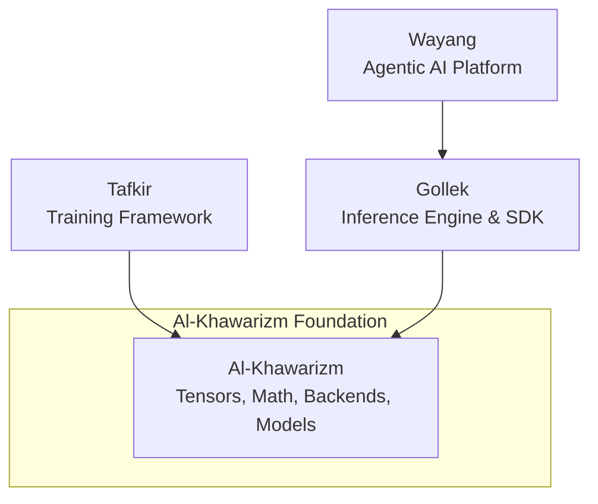

# Al-Khawarizm (الخوارزمي)

## "Modern AI Technology start from zero"

**Al-Khawarizm** is the foundational tensor, compute, and modeling infrastructure for the Kayys AI ecosystem in Java. 

If you are coming from the Python AI ecosystem, you can think of Al-Khawarizm as **the Java equivalent of PyTorch**, combined with the foundational model configuration aspects of **Hugging Face Transformers**.

It is strictly an infrastructure and primitive layer. It does not generate text, nor does it run training loops. Instead, it provides the highly optimized, hardware-accelerated building blocks that higher-level frameworks use to accomplish those tasks.

## 🎯 Ecosystem Positioning

To understand Al-Khawarizm, it helps to see where it sits in the broader Kayys AI architecture:

### The Separation of Concerns
1. **Al-Khawarizm (Foundation)**: Knows how to multiply matrices, allocate memory on a GPU, parse SafeTensors, and define what a "Gemma" model looks like.
2. **Tafkir (Training)**: Knows how to calculate loss, apply gradients, run optimizers, and execute training loops. Depends on Al-Khawarizm for math and autograd.
3. **Gollek (Inference)**: Knows how to sample tokens, handle continuous batching, and route requests. Depends on Al-Khawarizm for fast forward passes and KV caching.
4. **Wayang (Application)**: Knows how to orchestrate multi-agent reasoning and RAG workflows. Depends on Gollek for text generation.

By isolating the heavy infrastructure into Al-Khawarizm, both Tafkir and Gollek can share the exact same hardware backends and memory models without dragging each other's specific dependencies around.

## 🏗️ Core Architecture & Modules

Al-Khawarizm is designed with a strict modular structure to maintain a clear Separation of Concerns:

* `core/`: The heart of Al-Khawarizm.
  * `alkhawarizm-tensor`: N-dimensional arrays, precision types (FP32, FP16, BF16, INT8).
  * `alkhawarizm-nn`: Neural network primitives and activation functions (GELU, SiLU).
  * `autograd`: Automatic differentiation for training (`tafkir` uses this).
  * `alkhawarizm-safetensor-*` / `alkhawarizm-gguf-*`: High-performance weight loaders.
  * `alkhawarizm-spi-model`: The foundational contract defining `ModelConfig`, `ModelArchitecture`, and `ModelRuntimeTraits`.
* `backend/`: Hardware-accelerated execution routes.
  * `cpu`, `metal` (Apple Silicon MPS), `cuda` (NVIDIA GPUs), `rocm` (AMD).
  * Each backend provides optimized kernels for the tensor operations defined in `core`.
* `models/`: Implementations of the `alkhawarizm-spi-model` contract for hundreds of specific model architectures (Gemma, Llama, Qwen, BERT, etc.). These provide the topology but NOT the inference logic.

## 🧑‍💻 Developer Guidance

When contributing to Al-Khawarizm or any downstream framework (`gollek` / `tafkir`), strictly adhere to the following principles:

### 1. Capabilities over Identities
**Never** write code that checks the identity of a model (e.g., `if (modelType.equals("gemma3"))`). This breaks extensibility.
Instead, check for operational capabilities (e.g., `if (traits.requiresTurnAwarePromptBos())`). If a new model needs a specific behavior, add a generic capability flag to `ModelRuntimeTraits` in `alkhawarizm-spi-model` and map the model to it.

### 2. Strict Separation of Concerns
* **Al-Khawarizm** handles math, tensors, and static topology. It should never contain code related to continuous batching, sampling temperature, or KV cache orchestration.
* **Gollek** handles the stateful, dynamic process of inference. It uses Al-Khawarizm's math and topology to execute the forward pass.
* **Tafkir** handles the stateful process of training. It uses Al-Khawarizm's autograd and math to execute the backward pass.

### 3. Adding New Models
To add a new model family, you do not need to touch the inference or training engines. 
Simply add a new module under `alkhawarizm/models/` that implements the `ModelArchitecture` SPI. Specify its precise structural traits (e.g., uses SwiGLU, has parallel attention) so that the engines know how to process it dynamically.

## 📝 License

Al-Khawarizm is licensed under the [MIT License](LICENSE.md).
